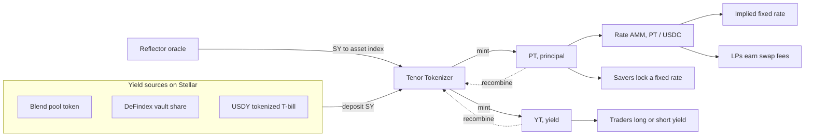
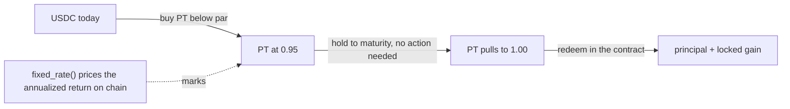

<p align="center">
  
</p>

<p align="center"><b>The fixed rate market for Stellar.</b> Split any yield bearing asset into a Principal token and a Yield token. Lock a guaranteed return, or trade the interest rate on its own.</p>

<p align="center">
  
  
  
  
</p>

<p align="center">
  <b><a href="https://tenor-blond-xi.vercel.app">Live app</a></b> ·
  <a href="https://stellar.expert/explorer/testnet/contract/CBPQRQTLLJQOJGXKDNVU4VKXHSTBZMFPUUSYY3X5J5RJZXNV5POWNNQV">Live contract on testnet</a>
</p>

---

## The problem

Stellar DeFi finally has real yield. Blend runs lending pools, DeFindex packages vault strategies, and tokenized treasuries like USDY bring government backed yield on chain. Real world assets and total value locked grew more than 100 percent in 2025.

Every bit of that yield is floating. A saver who parks stablecoins in a lending pool has no idea what the rate will be next week. It could be 8 percent today and 3 percent next month. There is no way to lock a rate, no way to buy a guaranteed return, and no way to take a view on where rates are going.

Look at the public Stellar DeFi directory and you find exchanges, lending, and collateralized debt. You find no fixed rate market, no yield tokenization, no interest rate products of any kind. The entire interest rate layer of DeFi, the layer that serious savers and institutions actually need, is empty. Floating only yield is the single biggest reason predictable savings and large real world asset flows stay off Stellar.

## The solution

Tenor is that missing layer. It takes any yield bearing asset and a maturity date and splits the asset into two tokens that trade on their own.

| Token | Redeems for | Who wants it |
| --- | --- | --- |
| **PT**, the principal token | exactly 1.00 of the asset at maturity | savers who want a guaranteed, fixed return |
| **YT**, the yield token | all the yield the asset earns until maturity | traders who want to go long or short the rate |

One rule ties them together: `PT(x) + YT(x) = x`. You can always recombine them back into the original asset. A principal token bought below 1.00 today and worth 1.00 at maturity is a locked fixed rate. A yield token is a pure bet on the interest rate.

<p align="center">
  
</p>

## Our approach

Three layers, each small and composable, built so the rest of Stellar plugs straight in.

1. **Tokenizer.** The core engine. Deposit a yield bearing asset, get equal PT and YT. Yield streams to YT holders using an accumulator so it splits correctly no matter when people join or leave. Principal redeems at maturity. This is the primitive.
2. **Time decay rate AMM.** A pool prices PT against a stable token, with a pull to par curve so the price climbs toward 1.00 as maturity approaches. This keeps the implied fixed rate stable over time instead of drifting with the clock. Buying PT here is how a saver locks a rate.
3. **Carry vault.** An on chain vault that takes a single deposit, buys the cheapest principal, holds it to maturity, redeems at par, and hands depositors the locked return. The quant strategy as one click.

A saver never has to understand any of this. They see one number, the fixed rate, type an amount, and lock it in a couple of clicks.

## Technical architecture



**Contracts (Soroban, Rust, `soroban-sdk` 26)**

- `contracts/tokenizer` carries the whole protocol: split and recombine, redeem at maturity, the yield accumulator for YT, the time decay PT rate AMM, and the fixed rate carry vault. Public entry points: `initialize`, `sync`, `deposit`, `combine`, `redeem_pt`, `claim_yield`, `transfer_pt`, `transfer_yt`, `add_liquidity`, `buy_pt`, `sell_pt`, `pt_price`, `fixed_rate`, `time_progress`, `quote_buy_pt`, `pending_yield`, `market_info`, `vault_deposit`, `vault_invest`, `vault_settle`, `vault_claim`, `vault_info`.
- `contracts/mock-token` is a small SEP-41 token used for the testnet demo so a fresh wallet can mint test USDC and test yield asset with no trustlines.

**Live on Stellar Testnet**

| Piece | Contract id |
| --- | --- |
| Tokenizer + Rate AMM | [`CBPQRQTL…POWNNQV`](https://stellar.expert/explorer/testnet/contract/CBPQRQTLLJQOJGXKDNVU4VKXHSTBZMFPUUSYY3X5J5RJZXNV5POWNNQV) |
| Test yield asset (TSY) | [`CACC63KH…QU5N5U6`](https://stellar.expert/explorer/testnet/contract/CACC63KHPZBAYUSK2EX6GZSKTS4M24TLDMMJXMTQHM2PFCTYWQU5N5U6) |
| Test USDC | [`CAF3LGHE…J2MX75B`](https://stellar.expert/explorer/testnet/contract/CAF3LGHESH7YB25JITBRVPYUZCT46OXGVFY4MGXR2QXYIUP7XJ2MX75B) |

The web app reads every number straight from these contracts. Nothing in the interface is mocked.

## The quant strategy: fixed rate carry

The strategy that turns the primitive into a product is a classic fixed income carry, adapted to on chain principal tokens.

A principal token pays 1.00 of the asset at maturity and nothing before. So it trades at a discount, say 0.95. Hold it to maturity and it pays 1.00. That 0.05 of pull to par is not luck and not a guess. It is contractually fixed the moment you buy, because redemption is fixed by the contract. Buy low, hold, redeem at par, book the spread.



**The math, on chain.** The contract turns a PT price into an annualized fixed rate:

```
fixed_rate = (1 / pt_price - 1) * (seconds_per_year / seconds_to_maturity)
```

At a 0.95 price with 180 days left, that is a 5.26 percent return over the tenor, about 10.7 percent annualized. `implied_fixed_rate` and `fixed_rate` compute this inside the contract, so the rate is not a frontend guess, it is read from chain.

**Why it is safe.** The return does not depend on where floating rates go, on liquidations, or on a counterparty paying you. Once you hold the principal token, the payout at maturity is fixed by the contract. The yield risk was sold off to the yield token holder. This is the same structure that makes zero coupon bonds the base building block of fixed income, now permissionless and composable.

## Why people will use it

- **Savers** get a real fixed rate on dollars. Lock a number and stop watching floating APYs.
- **Yield traders** get the first clean way to express a view on Stellar interest rates. Long the yield token if you think rates rise, sell it if you think they fall.
- **Liquidity providers** earn swap fees on a market that did not exist before.
- **Treasuries and real world asset issuers** finally get predictable, hedgeable returns, which is the precondition for moving size on chain.

## Why it beats what exists today

| | Floating lending (Blend, pools) | Bank certificate of deposit | **Tenor** |
| --- | --- | --- | --- |
| Rate is known upfront | No | Yes | **Yes** |
| Permissionless, global | Yes | No | **Yes** |
| Settles in seconds, low fees | Yes | No | **Yes** |
| Can trade the yield separately | No | No | **Yes** |
| Composable with other DeFi | Partly | No | **Yes** |
| Exists on Stellar | Yes | n/a | **Only here** |

Holding a yield stablecoin still leaves you exposed to a variable rate. A certificate of deposit is fixed but permissioned, slow, and locked in one institution. Tenor gives the fixed rate of a bond product with the openness, speed, and composability of Stellar.

## Why Stellar needs this

Stellar is betting on real world assets and stablecoin yield, and that bet grew more than 100 percent last year. But real world asset capital does not move for floating, unpredictable returns. It moves for fixed rates it can model and hedge. Stellar has the yield bearing assets and none of the rate infrastructure to make them usable at scale.

Tenor is a primitive, not another app, so it lifts the whole ecosystem. It turns Blend positions, DeFindex shares, and tokenized treasuries into fixed rate instruments, gives them a yield market, and deepens liquidity across all of them. It composes with Reflector for marks and with any DEX for PT and YT trading. Filling the empty interest rate layer is one of the highest leverage things that can be built on Stellar right now, and it is exactly the kind of financial primitive the ecosystem is asking for.

## Testing

Every claim above is covered by tests. Run them:

```bash
# contracts
cargo test                       # 9 tests, 2 crates
stellar contract build           # builds both wasm artifacts

# web
cd web && pnpm install
./node_modules/.bin/tsc --noEmit # typecheck
./node_modules/.bin/next build   # production build
```

**Result: 9 passing, 0 failing.**

| Test | What it proves |
| --- | --- |
| `split_accrue_claim_redeem` | deposit splits into PT and YT, yield accrues to YT, claim and maturity redemption pay out correctly |
| `combine_is_inverse_of_split` | PT plus YT always recombine into the original asset |
| `yield_splits_between_two_yt_holders` | yield divides correctly across holders who join at different times and prices |
| `amm_prices_pt_and_locks_fixed_rate` | the AMM prices PT and discovers the implied fixed rate |
| `time_decay_pulls_price_to_par` | with no trades, the PT price is pulled to par by maturity and the implied rate stays stable |
| `carry_vault_locks_fixed_return` | deposit, invest, settle, claim: the vault turns a deposit into a larger payout at maturity |
| `full_lifecycle_saver_profits_at_maturity` | end to end, a saver locks a rate and redeems more than they paid |
| `implied_fixed_rate_matches_hand_math` | the on chain rate formula matches hand calculation |
| `mint_and_transfer` (mock-token) | the SEP-41 test token mints and transfers |

Beyond unit tests, the deployment is verified live: the web client reads `market_info`, `pt_price`, and `fixed_rate` directly from the testnet contract, and the production web build passes with no type errors.

## Running it

```bash
# 1. build and test contracts
cargo test && stellar contract build

# 2. deploy to your own testnet market (optional, a live one already exists)
./deploy/deploy_testnet.sh

# 3. run the app
cd web && pnpm install && pnpm dev
```

The app connects to Freighter. Switch Freighter to the Test network, use the in app faucet to get test tokens, then lock a fixed rate.

> Build note: if `cargo test` fails compiling `soroban-env-host`, pin the crypto dep with `cargo update -p ed25519-dalek@3.0.0 --precise 2.2.0`. A newer 3.0.0 breaks the host test utilities.

## References

- Stellar Community Fund 2025 impact report, on what the ecosystem funds and where growth is: https://medium.com/stellar-community/stellar-community-fund-2025-impact-report-6f6c6361aaca
- Stellar DeFi protocol directory, showing the categories that exist today: https://stellarplaybook.com/defi-on-stellar/defi-directory/
- Stellar, DeFi and real world assets on the network: https://stellar.org/blog/ecosystem/what-the-defi-is-happening-on-stellar
- Reflector, the Stellar price and rate oracle: https://reflector.network/docs
- Blend lending protocol: https://www.blend.capital
- DeFindex vault strategies: https://defindex.io
- Pendle, the yield tokenization model this generalizes to Stellar: https://www.pendle.finance
- Soroban smart contract docs: https://developers.stellar.org/docs/build/smart-contracts
- SEP-41 token interface: https://github.com/stellar/stellar-protocol/blob/master/ecosystem/sep-0041.md

## License

MIT
