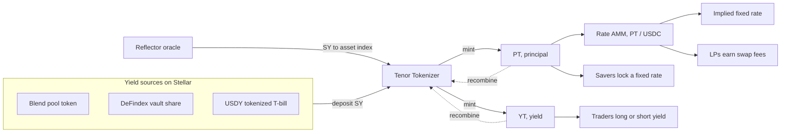
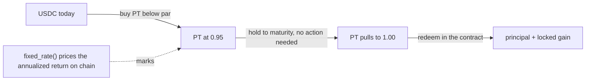

<p align="center">
  
</p>

<p align="center"><b>The fixed rate market for Stellar.</b> Split any yield bearing asset into a Principal token and a Yield token. Lock a guaranteed return, or trade the interest rate on its own.</p>

<p align="center">
  
  
  
  
  
  <a href="https://tenor-421719bc.mintlify.site"></a>
  <a href="https://x.com/tenor_stellar"></a>
</p>

<p align="center">
  <b><a href="https://tenor-blond-xi.vercel.app">Live app</a></b> ·
  <b><a href="https://tenor-421719bc.mintlify.site">Docs</a></b> ·
  <a href="https://youtu.be/7I1860loyZM">Animated explainer</a> ·
  <a href="https://www.youtube.com/watch?v=CiplkkkV45M">Product demo</a> ·
  <a href="assets/Tenor-Pitch.pptx">Pitch deck</a> ·
  <a href="https://stellar.expert/explorer/public/contract/CDZFACPLN7EDI55KU4OOSFWTD56DM4GVAUZJ6CMOUQTFKYUQ2BWFQVZI">Mainnet contract</a> ·
  <a href="https://x.com/tenor_stellar">Twitter</a>
</p>

https://github.com/user-attachments/assets/2fdbe1cd-acd9-4cdb-89d2-ce88b29a5c79

<p align="center">
  <sub>▶ Product demo — also on <a href="https://www.youtube.com/watch?v=CiplkkkV45M">YouTube</a></sub>
</p>

---

## The problem

Stellar DeFi finally has real yield. Blend runs lending pools, DeFindex packages vault strategies, and tokenized treasuries like USDY bring government backed yield on chain. Real world assets and total value locked grew more than 100 percent in 2025.

Every bit of that yield is floating. A saver who parks stablecoins in a lending pool has no idea what the rate will be next week. It could be 8 percent today and 3 percent next month. There is no way to lock a rate, no way to buy a guaranteed return, and no way to take a view on where rates are going.

Look at the public Stellar DeFi directory and you find exchanges, lending, and collateralized debt. You find no fixed rate market, no yield tokenization, no interest rate products of any kind. The entire interest rate layer of DeFi, the layer that serious savers and institutions actually need, is empty. Floating only yield is the single biggest reason predictable savings and large real world asset flows stay off Stellar.

## The solution

Tenor is that missing layer. It takes any yield bearing asset and a maturity date and splits the asset into two tokens that trade on their own.

| Token | Redeems for | Who wants it |
| --- | --- | --- |
| **PT**, the principal token | exactly 1.00 of the asset at maturity | savers who want a guaranteed, fixed return |
| **YT**, the yield token | all the yield the asset earns until maturity | traders who want to go long or short the rate |

One rule ties them together: `PT(x) + YT(x) = x`. You can always recombine them back into the original asset. A principal token bought below 1.00 today and worth 1.00 at maturity is a locked fixed rate. A yield token is a pure bet on the interest rate.

<p align="center">
  
</p>

## Our approach

Three layers, each small and composable, built so the rest of Stellar plugs straight in.

1. **Tokenizer.** The core engine. Deposit a yield bearing asset, get equal PT and YT. Yield streams to YT holders using an accumulator so it splits correctly no matter when people join or leave. Principal redeems at maturity. This is the primitive.
2. **Time decay rate AMM.** A pool prices PT against a stable token, with a pull to par curve so the price climbs toward 1.00 as maturity approaches. This keeps the implied fixed rate stable over time instead of drifting with the clock. Buying PT here is how a saver locks a rate.
3. **Carry vault.** An on chain vault that takes a single deposit, buys the cheapest principal, holds it to maturity, redeems at par, and hands depositors the locked return. The quant strategy as one click.

A saver never has to understand any of this. They see one number, the fixed rate, type an amount, and lock it in a couple of clicks.

## The app

The product is live on Stellar Testnet with a design system built for clarity, in a dark theme with a vibrant pink and lime brand.

- **One screen to lock a fixed rate, split yield, or run the carry vault.** Connect Freighter, mint test USDC and TSY from the built in faucet, and every number (fixed rate, PT price, pool liquidity, and your balances) is read straight from the contract, nothing mocked.
- **Live yield analytics.** A dedicated analytics page charts real Stellar yields from Blend and Ondo, pulled from DeFiLlama and refreshed hourly, week by week against a flat Tenor fixed rate, so you can see fixed against floating at a glance.
- **Docs on Mintlify.** Full protocol documentation, covering how a discount becomes a fixed rate, the on chain formula, the time decay AMM, and the technical architecture with diagrams, lives at [tenor-421719bc.mintlify.site](https://tenor-421719bc.mintlify.site).
- **Explicit wallet flow.** Connect opens Freighter for account approval, and a disconnect control lets you switch accounts.

Live app: [tenor-blond-xi.vercel.app](https://tenor-blond-xi.vercel.app)

## Technical architecture


```mermaid
flowchart LR
  subgraph SRC[Yield sources on Stellar]
    A[Blend pool token]
    B[DeFindex vault share]
    C[USDY tokenized T-bill]
  end
  SRC -->|deposit SY| TK[Tenor Tokenizer]
  RF[Reflector oracle] -->|SY to asset index| TK
  TK -->|mint| PT[PT, principal]
  TK -->|mint| YT[YT, yield]
  PT --> AMM[Rate AMM, PT / USDC]
  AMM --> RATE[Implied fixed rate]
  PT --> SAVERS[Savers lock a fixed rate]
  YT --> TRADERS[Traders long or short yield]
  AMM --> LPS[LPs earn swap fees]
  PT -.recombine.-> TK
  YT -.recombine.-> TK
```

**Contracts (Soroban, Rust, `soroban-sdk` 26)**

- `contracts/tokenizer` carries the whole protocol: split and recombine, redeem at maturity, the yield accumulator for YT, the time decay PT rate AMM, and the fixed rate carry vault. It also carries the safety guards: a bounded `sync` (a single index push cannot exceed `MaxSyncBps`, default +20%), an emergency `pause` that blocks new entries while still allowing exits, a `deposit_cap`, and `set_admin` for rotating control to a multisig. Public entry points: `initialize`, `sync`, `deposit`, `combine`, `redeem_pt`, `claim_yield`, `transfer_pt`, `transfer_yt`, `add_liquidity`, `buy_pt`, `sell_pt`, `pt_price`, `fixed_rate`, `time_progress`, `quote_buy_pt`, `pending_yield`, `market_info`, `vault_deposit`, `vault_invest`, `vault_settle`, `vault_claim`, `vault_info`, `set_admin`, `pause`, `unpause`, `set_deposit_cap`, `set_max_sync_bps`, `is_paused`, `deposit_cap`, `max_sync_bps`.
- `contracts/mock-token` is a small SEP-41 token used only for the testnet demo, so a fresh wallet can mint a test yield asset and test USDC with no trustlines. It is never deployed to mainnet.
- `deploy/keeper.sh` is the off-chain yield keeper: it reads a real Stellar yield rate (Blend USDC, live from DeFiLlama) and pushes it to the market index via `sync`, so the market tracks real yield instead of a hand-typed number.

## Deployments

Two networks, on purpose. Mainnet carries the real protocol against real assets; testnet carries the hardened build with a seeded market you can actually trade in.

| | Testnet | Mainnet |
| --- | --- | --- |
| Contract | v2, safety guards live | v1 |
| Underlying | mock test yield asset (TSY) | **real Ondo USDY** |
| Quote | mock test USDC | **real Circle USDC** |
| Liquidity | seeded, tradeable (~9.8% fixed rate) | none yet (awaiting audit + capital) |
| Yield keeper | run on-chain (live Blend rate) | not run (empty market) |
| Use it for | the interactive demo | proof the protocol is live on mainnet |

**Live on Stellar Mainnet**

| Piece | On chain id |
| --- | --- |
| Tokenizer + Rate AMM (v1) | [`CDZFACPL…QVZI`](https://stellar.expert/explorer/public/contract/CDZFACPLN7EDI55KU4OOSFWTD56DM4GVAUZJ6CMOUQTFKYUQ2BWFQVZI) |
| Underlying — Ondo USDY | [`CB3YA656…YGAGP`](https://stellar.expert/explorer/public/contract/CB3YA656OYIHU57657I5KGSBRHE5I3OZU4VFC22PYAOANFZHEWNYGAGP) |
| Quote — Circle USDC | [`CCW67TSZ…MI75`](https://stellar.expert/explorer/public/contract/CCW67TSZV3SSS2HXMBQ5JFGCKJNXKZM7UQUWUZPUTHXSTZLEO7SJMI75) |
| Deployer / admin wallet | [`GBESJK7N…CHOBE5EP`](https://stellar.expert/explorer/public/account/GBESJK7N25HADVP5W5RD2OEY6CNUF345ADSX2NKWOMIHJ46ZCHOBE5EP) |

Real Ondo USDY splits into PT + YT against real Circle USDC. No mock token was deployed to mainnet. The market launched empty, so `fixed_rate` and `pt_price` read 0 until liquidity is seeded — gated behind an audit and real capital (see the security note below). Wasm hash `8b7b2120…09e35`; full record in [`deploy/mainnet.json`](deploy/mainnet.json).

**Live on Stellar Testnet** (v2, the hardened build)

| Piece | On chain id |
| --- | --- |
| Tokenizer + Rate AMM (v2) | [`CAAB3SFP…GHQHVOI`](https://stellar.expert/explorer/testnet/contract/CAAB3SFPT7TT2ADKXBUCGNUIJHQBMIUZTOBEIMCBR4DI54STBGHQHVOI) |
| Test yield asset (TSY) | [`CBTKA7CV…ST57DQ`](https://stellar.expert/explorer/testnet/contract/CBTKA7CVL6GDL3Z4FUPBKELSVFB3JOWHLWGHRO5L3RBTXTO7GWST57DQ) |
| Test USDC | [`CCGU3ZNA…N7CP3T3E`](https://stellar.expert/explorer/testnet/contract/CCGU3ZNAI4OTQSX6JBWFVXFRGJMQAPTAG7KK5OOUXWSOWJLAN7CP3T3E) |
| Deployer / issuer wallet | [`GBESJK7N…CHOBE5EP`](https://stellar.expert/explorer/testnet/account/GBESJK7N25HADVP5W5RD2OEY6CNUF345ADSX2NKWOMIHJ46ZCHOBE5EP) |

The testnet underlying and quote are labeled test tokens, because testnet has no real assets — but every rate, price, and balance the app shows is read straight from the live contract, and the analytics and the yield keeper are driven by real Blend and Ondo data from DeFiLlama. Nothing is fabricated and presented as real.

## Mainnet economics

**The deployer wallet**

```
GBESJK7N25HADVP5W5RD2OEY6CNUF345ADSX2NKWOMIHJ46ZCHOBE5EP
```

One wallet, both networks. Stellar keypairs are network agnostic, so this is the same key that issued the testnet contracts above, with separate account state on each network. It is the account that pays the mainnet deploy fees and becomes the contract admin, and it is set as `TENOR_MAINNET_WALLET` in [`deploy/deploy_mainnet.sh`](deploy/deploy_mainnet.sh).

| | Mainnet | Testnet |
| --- | --- | --- |
| Account | [live](https://stellar.expert/explorer/public/account/GBESJK7N25HADVP5W5RD2OEY6CNUF345ADSX2NKWOMIHJ46ZCHOBE5EP), funded 24 Jul 2026 | [live](https://stellar.expert/explorer/testnet/account/GBESJK7N25HADVP5W5RD2OEY6CNUF345ADSX2NKWOMIHJ46ZCHOBE5EP) |
| Balance | 40.25 XLM | 9,994 test XLM |
| Trustlines | none, XLM only | — |

Admin is not a formality. This key is the only account that can call `sync`, which pushes the SY to asset index, and `vault_invest`, which deploys vault cash. Lose it and yield accrual and the carry vault both freeze permanently, with no recovery path in the contract.

**Cost**

Soroban charges for the bytes a transaction writes plus rent on the ledger entries it creates, and the write rate scales with how large the network's state already is. Mainnet state is far bigger than testnet's, so the same deploy costs about **17x more** there. The upload figures below were measured by simulating the real wasm against a mainnet RPC node, protocol 27, ledger 63,628,189; the rest are the testnet fees this repo actually paid, scaled by that multiplier.

| Step | Testnet (paid) | Mainnet |
| --- | --- | --- |
| Upload `tokenizer` wasm, 19,931 bytes | 1.70352 XLM | **29.33614 XLM** (measured) |
| Create the contract instance | 0.00215 XLM | 0.04 XLM |
| `initialize` the market | 0.01080 XLM | 0.19 XLM |
| `deposit`, split SY into PT + YT | 0.00995 XLM | 0.17 XLM |
| `add_liquidity`, seed the PT/USDC pool | 0.00807 XLM | 0.14 XLM |
| `vault_deposit` + `vault_invest` | 0.00503 XLM | 0.09 XLM |
| `sync`, one keeper index push | 0.00076 XLM | 0.01 XLM |
| **Total, first market end to end** | 1.74 XLM | **~30.6 XLM** (about 5.42 USD) |

Two things make this cheaper than it looks. The wasm upload is roughly 98 percent of the bill and happens **once**: every additional market reuses the same code entry, so listing a new maturity costs only the instance plus `initialize`, about **0.22 XLM**. And the mock token never ships to mainnet, since real markets use Blend, DeFindex, or USDY directly (uploading it would otherwise add 8.38238 XLM, also measured).

**Rent, and why the deploy cost is not the whole cost**

Mainnet's state archival settings, read from the live ledger, are `min_persistent_ttl` 2,073,600 ledgers and `max_entry_ttl` 3,110,400. At roughly five seconds a ledger that is about **120 days of life per payment**, up to a 180 day ceiling. The 20 KB code entry has to be renewed with `extend_ttl` before it lapses or it is archived and the market stops being invokable until someone pays to restore it. A 60 day renewal runs about 14 XLM, so budget on the order of **90 XLM a year** to keep one market alive.

Against that, 40.25 XLM funds exactly one deploy and no renewals. **~250 XLM** is the realistic number to hold: one deploy, one code revision if a fix is needed, and year one of rent, with headroom for the write rate drifting up as network state grows.

**Deploying**

```bash
stellar keys add deployer                    # if not already in the keystore
TENOR_SY=C...  ./deploy/deploy_mainnet.sh --dry-run   # preflight + live fee quote, spends nothing
TENOR_SY=C...  ./deploy/deploy_mainnet.sh             # asks for confirmation before spending
```

`TENOR_SY` is the contract id of the real yield bearing asset the market splits, a Blend pool token, a DeFindex vault share, or USDY. There is no default and no mock: `initialize` can only be called once per instance and the underlying is permanent, so the choice has to be deliberate. `TENOR_QUOTE` defaults to Circle's USDC on mainnet, `CCW67TSZ…MI75`.

The script refuses to run if the signing key resolves to anything other than the wallet above, and it will not deploy the mock token. Use a dedicated RPC rather than the default: `https://mainnet.sorobanrpc.com` returns 503 on roughly one call in five, and a dropped request between `upload` and `initialize` leaves a paid for code entry with no market behind it.

```bash
STELLAR_RPC_URL=https://your-provider/... TENOR_SY=C... ./deploy/deploy_mainnet.sh
```

## The quant strategy: fixed rate carry

The strategy that turns the primitive into a product is a classic fixed income carry, adapted to on chain principal tokens.

A principal token pays 1.00 of the asset at maturity and nothing before. So it trades at a discount, say 0.95. Hold it to maturity and it pays 1.00. That 0.05 of pull to par is not luck and not a guess. It is contractually fixed the moment you buy, because redemption is fixed by the contract. Buy low, hold, redeem at par, book the spread.


```mermaid
flowchart LR
  U[USDC today] -->|buy PT below par| P["PT at 0.95"]
  P -->|hold to maturity, no action needed| M["PT pulls to 1.00"]
  M -->|redeem in the contract| R["principal + locked gain"]
  RATE["fixed_rate() prices the annualized return on chain"] -.marks.-> P
```

**The math, on chain.** The contract turns a PT price into an annualized fixed rate:

```
fixed_rate = (1 / pt_price - 1) * (seconds_per_year / seconds_to_maturity)
```

At a 0.95 price with 180 days left, that is a 5.26 percent return over the tenor, about 10.7 percent annualized. `implied_fixed_rate` and `fixed_rate` compute this inside the contract, so the rate is not a frontend guess, it is read from chain.

**Why it is safe.** The return does not depend on where floating rates go, on liquidations, or on a counterparty paying you. Once you hold the principal token, the payout at maturity is fixed by the contract. The yield risk was sold off to the yield token holder. This is the same structure that makes zero coupon bonds the base building block of fixed income, now permissionless and composable.

## Why people will use it

- **Savers** get a real fixed rate on dollars. Lock a number and stop watching floating APYs.
- **Yield traders** get the first clean way to express a view on Stellar interest rates. Long the yield token if you think rates rise, sell it if you think they fall.
- **Liquidity providers** earn swap fees on a market that did not exist before.
- **Treasuries and real world asset issuers** finally get predictable, hedgeable returns, which is the precondition for moving size on chain.

## Why it beats what exists today

| | Floating lending (Blend, pools) | Bank certificate of deposit | **Tenor** |
| --- | --- | --- | --- |
| Rate is known upfront | No | Yes | **Yes** |
| Permissionless, global | Yes | No | **Yes** |
| Settles in seconds, low fees | Yes | No | **Yes** |
| Can trade the yield separately | No | No | **Yes** |
| Composable with other DeFi | Partly | No | **Yes** |
| Exists on Stellar | Yes | n/a | **Only here** |

Holding a yield stablecoin still leaves you exposed to a variable rate. A certificate of deposit is fixed but permissioned, slow, and locked in one institution. Tenor gives the fixed rate of a bond product with the openness, speed, and composability of Stellar.

## Why Stellar needs this

Stellar is betting on real world assets and stablecoin yield, and that bet grew more than 100 percent last year. But real world asset capital does not move for floating, unpredictable returns. It moves for fixed rates it can model and hedge. Stellar has the yield bearing assets and none of the rate infrastructure to make them usable at scale.

Tenor is a primitive, not another app, so it lifts the whole ecosystem. It turns Blend positions, DeFindex shares, and tokenized treasuries into fixed rate instruments, gives them a yield market, and deepens liquidity across all of them. It composes with Reflector for marks and with any DEX for PT and YT trading. Filling the empty interest rate layer is one of the highest leverage things that can be built on Stellar right now, and it is exactly the kind of financial primitive the ecosystem is asking for.

## Roadmap

Shipped:

- **Mainnet deployment** of the tokenizer, time decay AMM, and carry vault, with real Ondo USDY as the underlying and real Circle USDC as the quote.
- **Safety hardening** — bounded `sync`, `pause`, `deposit_cap`, and `set_admin` — built, tested, and live on the testnet build.
- **Real yield data** driving the market: the keeper reads Blend USDC's live rate from DeFiLlama and pushes it on-chain via `sync`; the analytics page charts live Blend and Ondo yields.

Next, in order:

1. **Audit** via the Soroban Security Audit Bank (Tenor auto-qualifies as a yield-bearing token protocol), then deploy the hardened v2 to mainnet.
2. **Multisig admin** — rotate the mainnet admin to a 2-of-3 account so no single key controls `sync` and `vault_invest`.
3. **Seed real liquidity** into the mainnet USDY/USDC market so it takes deposits and shows a live rate.
4. **Real yield sources as the underlying** end to end: Blend lending positions and DeFindex vault shares, not just USDY, with the keeper reading their on-chain rate directly instead of via DeFiLlama.
5. **PT and YT trading** routed through the Stellar DEX and Soroban AMMs, and **Reflector** for production marks.
6. **More maturities and markets**, so savers can choose a tenor and issuers can list their own assets.

**What this needs.** The gating resource is not code, it is funding. Deploying the hardened v2 to mainnet and keeping it alive for a year costs on the order of **~250 XLM** (measured: ~31 XLM to upload, plus ~90 XLM/year in rent, plus headroom for a post-audit redeploy). The audit itself is effectively free through the Soroban Security Audit Bank once Tenor is an SCF award recipient. And seeding a real market is capital in real USDY and USDC, not XLM. So the path is: **SCF grant → free audit → fund the mainnet v2 deploy and rent → seed real liquidity.**

## Repository layout

- `contracts/tokenizer` — the whole protocol in Rust and Soroban: split and recombine, the yield accumulator, redemption, the time decay PT/USDC AMM, the carry vault, and the safety guards (bounded sync, pause, deposit cap, admin rotation).
- `contracts/mock-token` — a small SEP-41 token for the testnet demo.
- `web/` — the Next.js app: the landing page, the fixed rate app, and the live analytics page.
- `docs/` — the Mintlify documentation site.
- `deploy/deploy_testnet.sh` — deploys the full testnet market (mock tokens, tokenizer, seeded pool).
- `deploy/deploy_mainnet.sh` — deploys the tokenizer to mainnet against a real yield asset; refuses to run from the wrong wallet or to ship the mock token.
- `deploy/keeper.sh` — the yield keeper: reads a live Blend rate from DeFiLlama and pushes it on-chain via `sync`.

## Testing

Every claim above is covered by tests. Run them:

```bash
# contracts
cargo test                       # 15 tests, 2 crates
cargo clippy --all-targets -- -D warnings   # lint, warnings as errors
stellar contract build           # builds both wasm artifacts

# web
cd web && pnpm install
./node_modules/.bin/tsc --noEmit # typecheck
./node_modules/.bin/next build   # production build
```

**Result: 15 passing, 0 failing.**

| Test | What it proves |
| --- | --- |
| `split_accrue_claim_redeem` | deposit splits into PT and YT, yield accrues to YT, claim and maturity redemption pay out correctly |
| `combine_is_inverse_of_split` | PT plus YT always recombine into the original asset |
| `yield_splits_between_two_yt_holders` | yield divides correctly across holders who join at different times and prices |
| `amm_prices_pt_and_locks_fixed_rate` | the AMM prices PT and discovers the implied fixed rate |
| `time_decay_pulls_price_to_par` | with no trades, the PT price is pulled to par by maturity and the implied rate stays stable |
| `carry_vault_locks_fixed_return` | deposit, invest, settle, claim: the vault turns a deposit into a larger payout at maturity |
| `full_lifecycle_saver_profits_at_maturity` | end to end, a saver locks a rate and redeems more than they paid |
| `implied_fixed_rate_matches_hand_math` | the on chain rate formula matches hand calculation |
| `sync_beyond_bound_reverts` | a single `sync` past `MaxSyncBps` reverts, so no push can mint unbounded yield |
| `sync_within_bound_and_retune` | a normal push accrues yield, and the admin can retune the bound |
| `pause_blocks_entry_allows_exit` | pause blocks new deposits while recombining out still works |
| `deposit_while_paused_reverts` | deposits revert while the market is paused |
| `deposit_cap_enforced` | deposits past the configured cap revert |
| `admin_rotation` | `set_admin` moves control of the privileged calls |
| `mint_and_transfer` (mock-token) | the SEP-41 test token mints and transfers |

Beyond unit tests, the deployment is verified live: the web client reads `market_info`, `pt_price`, and `fixed_rate` directly from the testnet contract, the keeper's `sync` transactions are on-chain, and the production web build passes with no type errors.

## Running it

```bash
# 1. build and test contracts
cargo test && stellar contract build

# 2. deploy to your own testnet market (optional, a live one already exists)
./deploy/deploy_testnet.sh

# 3. run the app
cd web && pnpm install && pnpm dev
```

The app connects to Freighter. Switch Freighter to the Test network, use the in app faucet to get test tokens, then lock a fixed rate.

> Build note: if `cargo test` fails compiling `soroban-env-host`, pin the crypto dep with `cargo update -p ed25519-dalek@3.0.0 --precise 2.2.0`. A newer 3.0.0 breaks the host test utilities.

## References

- Stellar Community Fund 2025 impact report, on what the ecosystem funds and where growth is: https://medium.com/stellar-community/stellar-community-fund-2025-impact-report-6f6c6361aaca
- Stellar DeFi protocol directory, showing the categories that exist today: https://stellarplaybook.com/defi-on-stellar/defi-directory/
- Stellar, DeFi and real world assets on the network: https://stellar.org/blog/ecosystem/what-the-defi-is-happening-on-stellar
- Reflector, the Stellar price and rate oracle: https://reflector.network/docs
- Blend lending protocol: https://www.blend.capital
- DeFindex vault strategies: https://defindex.io
- Pendle, the yield tokenization model this generalizes to Stellar: https://www.pendle.finance
- Soroban smart contract docs: https://developers.stellar.org/docs/build/smart-contracts
- SEP-41 token interface: https://github.com/stellar/stellar-protocol/blob/master/ecosystem/sep-0041.md

## License

MIT
