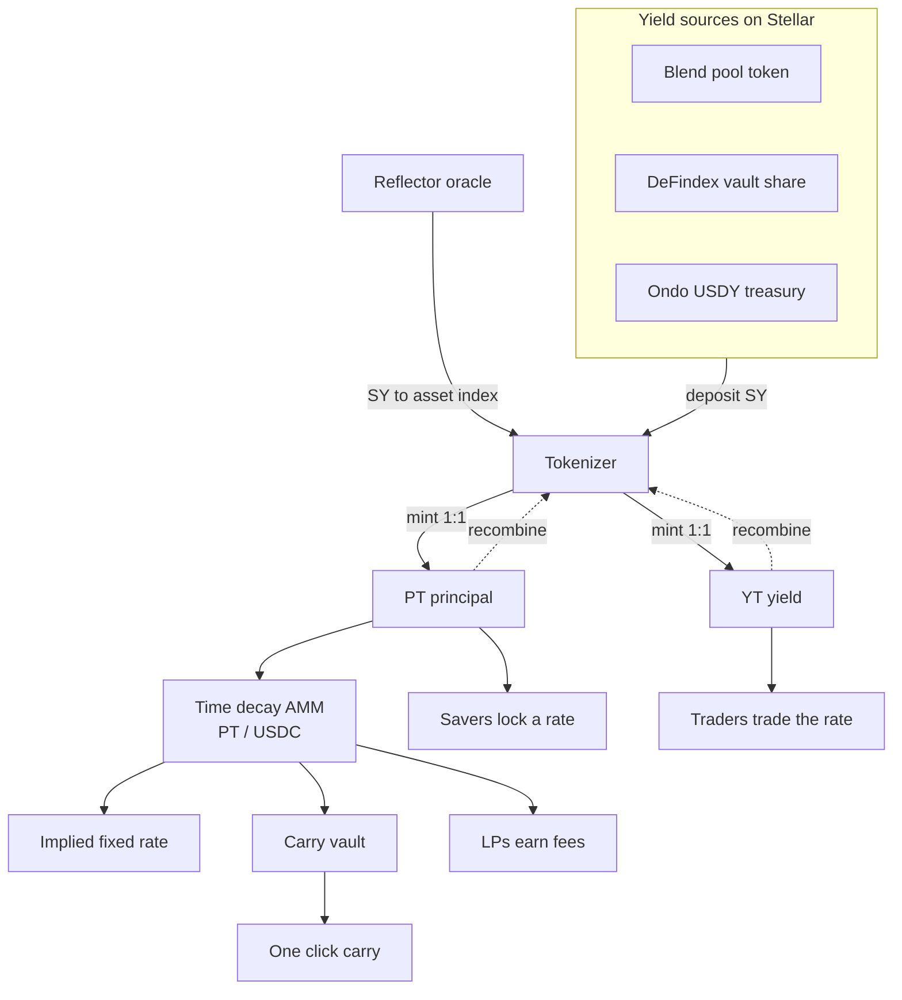
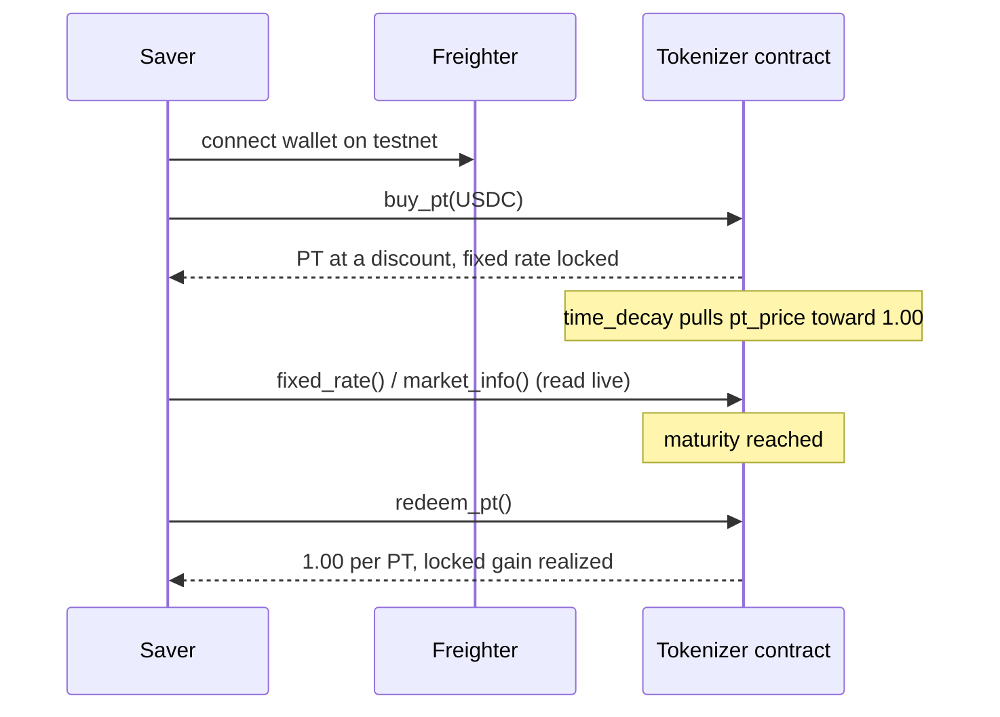

Tenor is built as three small, composable layers on Soroban, so the rest of
Stellar can plug straight in. This page shows the whole product and the exact
contract surface.

## The whole product at a glance

## The three layers

<CardGroup cols={3}>
  <Card title="1. Tokenizer" icon="scissors">
    The core primitive. Splits an asset into PT and YT, streams yield to YT with
    an accumulator, and redeems PT at maturity.
  </Card>
  <Card title="2. Time decay AMM" icon="wave-square">
    Prices PT against USDC with a pull to par curve, so the implied fixed rate
    stays stable and PT lands at par by maturity.
  </Card>
  <Card title="3. Carry vault" icon="robot">
    Takes one deposit, buys the cheapest PT, holds to maturity, redeems at par,
    and returns the locked gain.
  </Card>
</CardGroup>

## Contracts

Built with Soroban, Rust, and `soroban-sdk` 26.

- **`contracts/tokenizer`** carries the whole protocol: split and recombine,
  redeem at maturity, the yield accumulator for YT, the time decay PT rate AMM,
  and the fixed rate carry vault.
- **`contracts/mock-token`** is a small SEP-41 token used for the testnet demo so
  a fresh wallet can mint test USDC and a test yield asset with no trustlines.

### Entry points

<AccordionGroup>
  <Accordion title="Setup and accounting">
    `initialize`, `sync` — configure the market and refresh accrual.
  </Accordion>
  <Accordion title="Split and redeem">
    `deposit` (split SY into PT and YT), `combine` (recombine into SY),
    `redeem_pt` (redeem principal at maturity), `claim_yield` (collect accrued
    yield), `transfer_pt`, `transfer_yt`.
  </Accordion>
  <Accordion title="Market and AMM">
    `add_liquidity`, `buy_pt`, `sell_pt`, `pt_price`, `fixed_rate`,
    `time_progress`, `quote_buy_pt`, `pending_yield`, `market_info`.
  </Accordion>
  <Accordion title="Carry vault">
    `vault_deposit`, `vault_invest`, `vault_settle`, `vault_claim`, `vault_info`.
  </Accordion>
</AccordionGroup>

## A full lifecycle

How a saver's position moves from deposit to redemption on chain.

## Composability

Tenor is a primitive, not a walled app. It composes with the ecosystem:

- **Reflector** provides the SY to asset index used to mark the underlying.
- **Any DEX** can list PT and YT for trading.
- **Blend, DeFindex, and tokenized treasuries** are the yield sources it tokenizes.

Filling the empty interest rate layer lifts all of them: it turns their positions
into fixed rate instruments and gives them a yield market, deepening liquidity
across the network.

## Verification

The protocol ships with a test suite that backs every claim, including
`time_decay_pulls_price_to_par`, `carry_vault_locks_fixed_return`,
`full_lifecycle_saver_profits_at_maturity`, and
`implied_fixed_rate_matches_hand_math`. Beyond unit tests, the deployment is
verified live: the web client reads `market_info`, `pt_price`, and `fixed_rate`
straight from the testnet contract. See [deployed contracts](/contracts).
