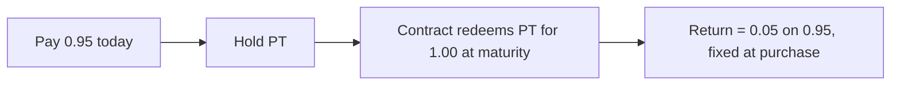

People use "fixed rate" and "fixed yield" loosely, so it is worth being exact.
Tenor promises a **fixed rate**: a return that is known in full the moment you
buy, for the whole length of the tenor, and cannot change afterward. This page
explains why that promise holds.

## Fixed yield is not the same thing

A "fixed yield" product usually means a pool that advertises an APY. That APY is a
snapshot. It is recomputed every block from supply and demand, and it drifts. You
might deposit at 8 percent and find yourself earning 3 percent a month later. The
headline number was real when you read it, but nothing locked it.

A **fixed rate** is different. It is a price agreed today for money delivered on a
specific future date. Once the trade is done, the rate is settled. Markets can do
whatever they like and your outcome does not move.

<Note>
  Fixed yield answers "what is the pool paying right now?" Fixed rate answers
  "what will I have earned when this matures, no matter what happens in between?"
  Tenor is the second kind.
</Note>

## Where the guarantee comes from

The guarantee is not a marketing claim. It comes from one hard rule in the
contract: **a principal token redeems for exactly 1.00 of the underlying asset at
maturity**. That is fixed in code, not set by the market.

Because the payout is fixed at 1.00, the only thing that varies is the price you
pay to get there. A principal token that pays 1.00 later must trade below 1.00
today, say 0.95. The instant you buy at 0.95, three numbers are locked:

1. **What you pay** now: 0.95.
2. **What you receive** at maturity: 1.00, guaranteed by the contract.
3. **When** you receive it: the fixed maturity date.

Everything needed to compute your return is known and settled. Nothing left to
float.

## What happened to the risk

The yield the asset earns did not vanish. It was **split off and sold to the yield
token holder**. When Tenor splits an asset into PT and YT, the YT holder takes all
the future yield, and with it all the uncertainty about where rates go. The PT
holder keeps only the fixed claim to par.

This is exactly how a zero coupon bond works. Strip the coupons off a bond and
what remains is a claim to the face value at maturity, which trades at a discount
that is a fixed rate. Tenor makes that split permissionless and composable on
Stellar.

<Note>
  So "fixed" does not mean "risk was removed from the world." It means the rate
  risk was moved to whoever wanted it. The saver holding PT is insulated from it.
</Note>

## Your rate depends on your price

One important subtlety. The fixed rate is a function of the price you pay, so it
is fixed **for you, from the moment you buy**, not a single number that is the
same for everyone forever.

- Buy the same principal token cheaper and you lock a higher rate.
- Pay more and you lock a lower one.
- Two people who buy at different prices lock different rates, and each stays
  fixed for that buyer.

As the AMM price moves, the rate on offer to the next buyer moves with it. The
[time decay AMM](/how-it-works) is what keeps that offered rate stable and
sensible over time instead of drifting with the clock.

## Why this is safe

Your payout at maturity does not depend on:

- where floating rates go after you buy,
- any liquidation or margin call,
- a counterparty choosing to pay you.

Once you hold the principal token, redemption at par is enforced by the contract.
That is the whole point of the design, and it is what lets Tenor say fixed and
mean it.
