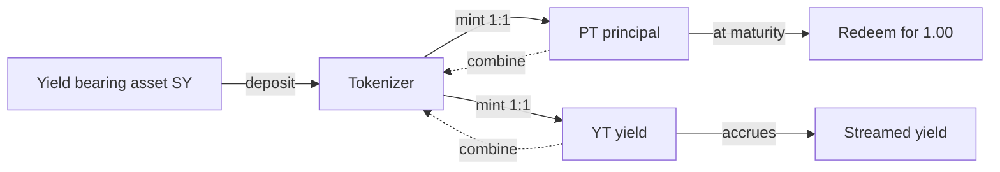
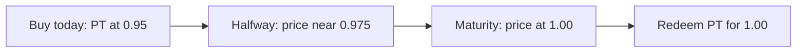

This page goes deep. If you only want the intuition, the short version is: buy a
principal token below par, hold it, redeem it at par, and the gap is a fixed
return. Everything below explains exactly how that works and why the number is
trustworthy.

## Splitting an asset

Give the tokenizer a yield bearing asset (call it SY) and it mints equal amounts
of two tokens:

- **PT**, the principal token, a claim to 1.00 of the asset at maturity.
- **YT**, the yield token, a claim to all the yield the asset earns until then.

The yield is streamed to YT holders with an **accumulator**: the contract tracks
yield per unit of YT, so it divides correctly no matter when holders join or
leave or at what size. At any time, PT and YT recombine back into the original
asset, which is the invariant `PT(x) + YT(x) = x`.



## The formula, derived

A principal token pays 1.00 at maturity and nothing before, so today it trades at
a discount. Suppose the price is `pt_price`. Your return over the whole tenor is
simply how much 1.00 is above that price, per unit paid:

```text
tenor_return = (1 / pt_price) - 1
```

At `pt_price = 0.95` that is `1 / 0.95 - 1 = 0.0526`, or 5.26 percent, earned over
the length of the tenor. To compare it with any other rate you annualize it by
scaling the tenor up to a full year:

```text
fixed_rate = (1 / pt_price - 1) * (seconds_per_year / seconds_to_maturity)
```

| Term | Meaning | Example at 0.95, 180 days |
| --- | --- | --- |
| `1 / pt_price - 1` | return over the tenor | 5.26% |
| `seconds_per_year / seconds_to_maturity` | annualizer | about 2.03 |
| `fixed_rate` | annualized fixed rate | about 10.7% |

The contract computes this in `implied_fixed_rate` and exposes it through
`fixed_rate`, so the number the app shows is read from chain, not estimated by the
frontend. The `implied_fixed_rate_matches_hand_math` test checks it against hand
calculation.

<Note>
  The rate is a function of price, so it is fixed for you the moment you buy.
  A lower price locks a higher rate. See [Why it is a fixed rate](/fixed-rate).
</Note>

## The time decay AMM

If a bond just sat at a fixed price, its implied rate would drift upward as
maturity approached, because the same discount over less time annualizes higher.
Tenor avoids that with a **time decay AMM**.

The pool prices PT against a stable token (USDC) with a **pull to par** curve. As
the tenor elapses, an effective reserve grows so that, with no trades, the PT
price climbs steadily toward 1.00 by maturity. Two things follow:

1. The **implied fixed rate stays stable** over time instead of drifting with the
   clock. A rate quoted today still means roughly the same thing next week.
2. Principal **cannot be worth less than par at settlement**, because the curve
   lands the price at 1.00 exactly at maturity.



The `time_decay_pulls_price_to_par` test proves that, with no trades, the price is
pulled to par by maturity and the implied rate stays stable. Buying PT in this
pool is how a saver locks a rate; `quote_buy_pt` previews the trade and `buy_pt`
executes it.

## The carry vault

The carry vault turns the whole strategy into a single deposit. It is a classic
fixed income carry adapted to on chain principal tokens.

<Steps>
  <Step title="Deposit">
    Put USDC into the vault once. You receive vault shares. `vault_deposit`.
  </Step>
  <Step title="Invest">
    The vault buys the cheapest available principal token. `vault_invest`.
  </Step>
  <Step title="Hold and settle">
    It holds to maturity, then redeems at par. `vault_settle`.
  </Step>
  <Step title="Claim">
    You claim your share of the larger payout. `vault_claim`.
  </Step>
</Steps>

No liquidations, no floating rate risk. The `carry_vault_locks_fixed_return` test
shows a deposit becoming a larger payout at maturity.

## How to use each role

<Tabs>
  <Tab title="Saver">
    Buy PT with USDC in the app, or deposit into the carry vault to have it done
    for you. Hold to maturity and redeem for 1.00. The discount you paid is your
    locked return.
  </Tab>
  <Tab title="Yield trader">
    Split an asset into PT and YT, then hold or sell YT. Long YT if you think
    rates rise, sell it if you think they fall. This is a pure position on the
    Stellar interest rate.
  </Tab>
  <Tab title="Liquidity provider">
    Seed the PT and USDC pool with `add_liquidity` and earn swap fees on a market
    that did not exist before.
  </Tab>
</Tabs>

## What keeps it honest

Every value the app shows is read straight from the contract: `market_info`,
`pt_price`, `fixed_rate`, `time_progress`, and balances. Nothing in the interface
is mocked. See the [architecture](/architecture) for the full contract surface.
