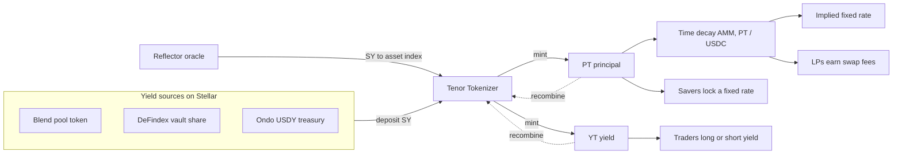

Tenor is a fixed rate protocol on Stellar. It takes any yield bearing asset and a
maturity date, splits the asset into a **principal token (PT)** and a **yield
token (YT)**, prices them with a time decay AMM, and runs a fixed rate carry vault
on top. Everything in these docs is live on Stellar testnet.

## The problem

Stellar DeFi finally has real yield. Blend runs lending pools, DeFindex packages
vault strategies, and tokenized treasuries like Ondo USDY bring government backed
yield on chain. Real world assets on Stellar grew more than 100 percent last year.

Every bit of that yield floats. Park stablecoins in a lending pool and you have no
idea what next week pays. It might be 8 percent today and 3 percent next month.
There is no way to lock a rate, no way to buy a guaranteed return, and no way to
take a position on where rates go. The entire interest rate layer of DeFi, the
part serious savers and institutions actually need, is empty on Stellar.

## The solution

Tenor is that missing layer. Give it a yield bearing asset and a maturity and it
mints two tokens that trade on their own.

| Token | Redeems for | Who wants it |
| --- | --- | --- |
| **PT**, principal token | exactly 1.00 of the asset at maturity | savers who want a guaranteed, fixed return |
| **YT**, yield token | all the yield the asset earns until maturity | traders who want to go long or short the rate |

One rule ties them together: `PT(x) + YT(x) = x`. Principal plus yield always
recombine into the original asset. A principal token bought below 1.00 today and
worth 1.00 at maturity is a locked fixed rate. A yield token is a pure position on
the interest rate.

## How the pieces fit

## What you can do

<CardGroup cols={2}>
  <Card title="Lock a fixed rate" icon="lock" href="/fixed-rate">
    Buy principal at a discount. It redeems for 1.00 at maturity, so the discount
    is your guaranteed return.
  </Card>
  <Card title="Trade the rate" icon="chart-line" href="/concepts">
    Hold or sell the yield token to go long or short the interest rate on its own.
  </Card>
  <Card title="Provide liquidity" icon="layer-group" href="/how-it-works">
    Seed the principal and USDC pool and earn swap fees on a market that did not
    exist before.
  </Card>
  <Card title="Automate the carry" icon="robot" href="/how-it-works">
    Deposit once into the vault. It buys discounted principal, holds to maturity,
    and redeems at par.
  </Card>
</CardGroup>

## How Tenor compares

| | Floating lending | Bank certificate of deposit | Tenor |
| --- | --- | --- | --- |
| Rate known upfront | No | Yes | **Yes** |
| Permissionless and global | Yes | No | **Yes** |
| Settles in seconds | Yes | No | **Yes** |
| Trade the yield separately | No | No | **Yes** |
| Composable with DeFi | Partly | No | **Yes** |

Ready to try it? Head to the [quickstart](/quickstart), or read on to see why the
rate is genuinely fixed.
